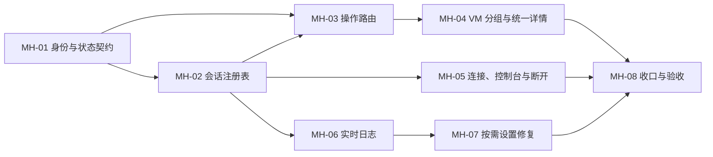

# 多宿主会话管理实施计划

## 目标

实现 [多宿主正式规格](../../doc/multi-host-management-spec.md) 与 [多宿主会话和虚拟机分组设计](../../doc/multi-host-management-design.md)：本机固定在线，多台远程 Hyper-V 宿主可同时连接、独立掉线重连和断开，所有 VM 操作按 `HostId` 明确路由。

## 当前基线

- 现有实现以 `IActiveHostSessionCoordinator` 和单一 `ActiveHostSession` 为进程级状态。
- `VirtualMachinesPageViewModel` 只有一个 `VmList`，宿主变化时清空并重载。
- `ActiveHostVmOperations`、`ActiveHostConsoleSessions` 和能力矩阵从全局活动宿主捕获上下文。
- `HostConnectionPageViewModel` 需要用户先诊断再连接，并提供“切回本机”和常驻“配置预检”。
- `AppLog` 只写滚动文件，诊断结束后才把完整日志字符串写入 UI。
- 现有远程配置、凭据、诊断、预检和回滚实现继续复用。

## 约束

- WPF / .NET 8 / WPF-UI 4.3，保持现有主题资源和状态视觉。
- WMI/DCOM 为管理通道，TCP 2179 为控制台通道。
- 新增和修改的文本文件必须是 UTF-8 无 BOM。
- 不在配置、日志、异常或 UI 中暴露密码、令牌或凭据对象。
- 不清理或回退当前工作树已有修改和验收证据。
- 产品构建和集成运行器必须串行执行，因为两者会写入 `src/obj`。

## GitHub 纵向交付

- #15 扩展宿主身份与多会话注册表；无阻塞，是当前 frontier。
- #16 让本机与首台远程宿主并列管理；被 #15 阻塞。
- #17 支持多台远程宿主并隔离操作；被 #16 阻塞。
- #18 实现单宿主旧数据与独立自动重连；被 #17 阻塞。
- #19 安全断开宿主及其控制台；被 #17 阻塞。
- #20 实时展示当前宿主的脱敏日志；被 #15 阻塞。
- #21 按诊断结果提供设置检查与修复；被 #19、#20 阻塞。
- #22 收缩旧活动宿主模型并完成发布验收；被 #18、#19、#21 阻塞。

这些 Issue 是可领取的纵向交付单元；下方波次是每个 Issue 内部使用的技术路线，不替代 Issue 的用户行为验收标准。

## 内部技术路线

### 波次 1：身份和值对象

任务 `MH-01`：定义 `HostId`、`VmKey`、每宿主代次、注册表快照和状态不变量；先用测试锁定本机固定存在、远程会话并存和旧代次隔离。

主要文件范围：

- `src/Services/Remote/Sessions/`
- `tests/ExHyperV.Tests/SessionSwitchTests.cs`
- 新增多宿主注册表行为测试

完成门槛：测试可以同时表达本机、远程 A、远程 B，且不再依赖“选中宿主即活动宿主”。

### 波次 2：会话注册表与操作路由

任务 `MH-02`：实现 `IHostSessionRegistry`，把连接、每宿主写锁、掉线和自动重连从全局状态迁入独立会话。

任务 `MH-03`：实现 `IHostOperationRouter`，迁移 VM 读写、WMI 上下文解析、代次校验和断线报告。所有 VM 命令必须显式传入 `HostId` 或 `VmKey`。

主要文件范围：

- `src/Services/Remote/Sessions/`
- `src/Services/Remote/Vms/`
- `src/Services/Vm/`
- `src/Tools/Api/`
- `tests/ExHyperV.Tests/VmOperationTests.cs`
- `tests/ExHyperV.Tests/ReconnectTests.cs`

完成门槛：宿主 A 的写锁、掉线或旧返回值不能阻塞或污染宿主 B；本机路径保持兼容。

### 波次 3：VM 分组与统一详情

任务 `MH-04`：增加 `HostVmGroupViewModel`，将 VM 页面从单一 `VmList` 改为宿主分组，建立跨组选择规则和每宿主刷新生命周期。

主要文件范围：

- `src/ViewModels/VirtualMachinesPageViewModel*.cs`
- `src/Views/Pages/VirtualMachinesPage.xaml`
- `src/ViewModels/VmInstanceViewModel.cs` 或实际 VM 条目模型文件
- VM 页面相关行为和 XAML 验证测试

完成门槛：本机固定第一组；同时出现两个远程组；断开只移除目标组；本机和远程复用同一详情模板；永久不支持项隐藏、临时不可用项置灰并有 Tooltip。

### 波次 4：连接、控制台和主动断开

任务 `MH-05`：把“主机连接”页改为连接/断开状态按钮，连接时自动执行最新诊断；增加按宿主控制台窗口注册表和断开事务。

主要文件范围：

- `src/ViewModels/HostConnectionPageViewModel.cs`
- `src/Views/Pages/HostConnectionPage.xaml`
- `src/Services/Remote/Consoles/`
- `src/Views/Windows/ConsoleWindow.xaml.cs`
- `src/Interaction/Dialogs.cs`
- `tests/ExHyperV.Tests/DiagnosticsTests.cs`
- `tests/ExHyperV.Tests/ConsoleSessionTests.cs`

完成门槛：WMI 成功即可连接；2179 失败只禁用控制台；密码错误有明确提示；有目标宿主控制台时确认后关闭并断开；取消无副作用；不再显示“切回本机”。

### 波次 5：实时日志与按需修复

任务 `MH-06`：实现结构化 `IHostLogFeed`，让磁盘与 UI 复用同一脱敏条目；诊断和重连日志逐条发布并按选中宿主过滤。

任务 `MH-07`：移除常驻预检入口，仅在诊断发现可处理问题时展示“检查并修复设置”，复用现有只读预检、精确 `确认`、网络列表选择、执行和回滚流水线。

主要文件范围：

- `src/Services/Shared/Logging/`
- `src/Services/Remote/Diagnostics/`
- `src/ViewModels/HostConnectionPageViewModel.cs`
- `src/Views/Pages/HostConnectionPage.xaml`
- `src/ViewModels/HostPreflightViewModel.cs`
- `tests/ExHyperV.Tests/DiagnosticsTests.cs`
- `tests/ExHyperV.Tests/PreflightTests.cs`
- `tests/ExHyperV.Tests/ConfigurationTests.cs`

完成门槛：日志实时到达、按宿主隔离、滚动跟随可暂停恢复、内存有界且无敏感数据；未输入精确 `确认` 时配置流水线零修改。

### 波次 6：收口与端到端验收

任务 `MH-08`：删除旧活动宿主兼容路径和分叉模板，更新文档，并完成自动化、WPF 视觉和受控宿主验收。

主要文件范围：

- `src/App.xaml.cs`
- 所有残留 `ActiveHostSession` / `IActiveHostSessionCoordinator` 调用点
- `tests/ExHyperV.Tests/`
- `tests/ExHyperV.IntegrationTests/`
- `README.md`
- `README_zh.md`
- `doc/remote-host-management.md`
- `doc/remote-host-management-spec.md`

完成门槛：代码中不存在依赖全局活动宿主的操作路径；本机 + `10.0.0.6` 实机流程通过；两远程并行由确定性测试覆盖；Release 构建、XAML、编码和差异检查通过。

## 依赖图



## 验证策略

每个任务至少执行与其范围对应的确定性测试；每个波次结束执行：

```powershell
dotnet run --project tests/ExHyperV.Tests/ExHyperV.Tests.csproj -c Release
dotnet build src/ExHyperV.csproj -c Release
git diff --check
```

最终受控宿主验收使用现有默认关闭的集成运行器。危险动作继续由各自的精确中文 `确认` 开关控制，不因本计划自动获得执行权限。

## 风险与处理

| 风险 | 处理 |
|---|---|
| 大量 VM 命令隐式读取全局宿主 | 先建立 `IHostOperationRouter`，以源代码门禁阻止新增绕过点 |
| 多宿主刷新导致结果串写 | 每组独立取消令牌和 `SessionGeneration`，UI 合并前校验 `VmKey` |
| 写操作与主动断开竞态 | 每宿主写租约；目标宿主写计数非零时禁止断开 |
| 控制台窗口无法按宿主关闭 | 所有窗口在创建/关闭时登记到 `IHostConsoleRegistry` |
| 实时日志引入脱敏旁路 | 在分发到磁盘与内存之前只生成一次已脱敏 `AppLogEntry` |
| UI 模板合并造成现有功能回归 | 先建立能力投影测试，再合并模板并做亮/暗、宽/窄截图检查 |
| 一次重构范围过大 | 按波次提交，每波保持可构建；旧接口只作短期迁移并在 `MH-08` 删除 |

## 完成条件

- [ ] `SUBTASKS.csv` 中所有任务为 `DONE`。
- [ ] 正式设计中的自动化、UI 和受控宿主验收项均有当前证据。
- [ ] 本机始终存在，至少两台远程会话可在测试中并行存在且互不影响。
- [ ] 所有 VM 读写、控制台和断开动作都有明确 `HostId`。
- [ ] 错误密码、权限不足、WMI/DCOM 失败和 TCP 2179 失败分别呈现。
- [ ] 磁盘日志和实时日志使用相同脱敏结果，且磁盘仍保持 100 MiB x 2。
- [ ] Release 构建、确定性测试、XAML 检查、UTF-8 无 BOM 检查和 `git diff --check` 通过。
