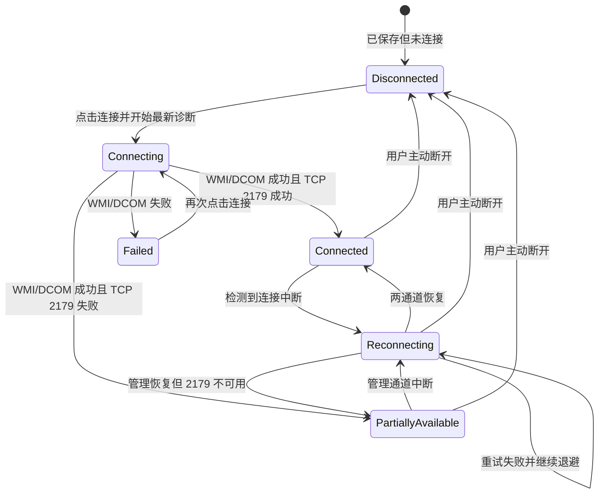

# ExHyperV 多宿主会话与虚拟机分组设计

> 状态：已确认，待实施
>
> 确认日期：2026-08-15
>
> 适用范围：本机与多台局域网 Hyper-V 宿主并行管理
>
> 正式规格：[multi-host-management-spec.md](multi-host-management-spec.md)
>
> 依赖基线：[remote-host-management-spec.md](remote-host-management-spec.md)

## 1. 背景与目标

现有远程宿主管理以单一 `ActiveHostSession` 为中心。连接远程宿主时，应用会替换当前活动宿主并清空虚拟机列表；切回本机时再次替换整页状态。这种模型不能满足以下工作流：

- 本地计算机始终可见、可操作。
- 同时连接多台远程宿主，并在同一个“虚拟机”页面查看各自的虚拟机。
- 单台远程宿主掉线、重连或断开时，不影响其他宿主。
- 所有读写、控制台和日志行为都能明确归属到具体宿主，避免跨宿主误操作。

本次迭代将“全局活动宿主”改为“固定本机会话 + 多个远程会话”，并保持现有 WMI/DCOM 管理通道、TCP 2179 控制台通道、Windows 凭据管理器和安全配置流程不变。

## 2. 已确认需求

### 2.1 会话与列表

- 应用启动时只自动加载本机；保存的远程宿主不会自动连接。
- 本机会话固定存在，不提供断开操作。
- 用户可以同时连接多台已保存的远程宿主。
- “虚拟机”页面按宿主分组。本机固定为第一组，远程宿主按连接顺序排列。
- 正常断开远程宿主后，移除对应分组及其虚拟机数据，但保留已保存的主机配置。
- 意外掉线时保留该宿主分组和最后一次成功数据，禁用写操作并自动重连。
- 每次只能选择同一宿主内的虚拟机；选择另一个宿主的虚拟机时清除原选择。

### 2.2 连接、诊断与断开

- 点击“连接到此主机”后自动执行最新诊断，不依赖旧诊断结果。
- WMI/DCOM 成功即建立管理会话并加载虚拟机。
- TCP 2179 失败不会阻止连接，只禁用该宿主的控制台能力并显示原因。
- 显式凭据错误必须显示“用户名或密码错误”一类明确结果，不得归类为普通网络故障。
- 连接成功后按钮变为“断开”。不再提供“切回本机”按钮。
- 目标宿主存在写操作时，其“断开”按钮禁用并通过 Tooltip 说明原因。
- 目标宿主没有控制台窗口时直接断开。
- 目标宿主存在控制台窗口时弹出确认；确认后关闭该宿主的所有控制台窗口并断开，取消则不改变任何状态。

### 2.3 界面与能力

- 本机和远程宿主复用相同的字体、颜色、按钮和虚拟机详情布局。
- 状态复用现有绿色勾、红色叉、黄色点和红色点，不增加独立视觉语言。
- 不使用硬编码黑色文字，所有前景色来自现有 WPF-UI 主题资源。
- 本机与远程均可获取的数据采用相同布局；永久无法获取的远程字段或功能不展示。
- 临时不可用的操作保留并置灰，Tooltip 显示具体原因。
- 删除会挤压工具栏布局的常驻提示文字；禁用原因改由按钮 Tooltip 承载。

### 2.4 日志与配置修复

- “主机连接”的日志 Tab 只显示当前选中宿主的实时日志。
- 日志默认跟随最新条目；用户向上滚动后暂停自动跟随，并显示“回到最新”图标按钮。
- 磁盘日志继续写入程序目录下的 `logs`，单文件 100 MiB，仅保留当前和上一份日志。
- 移除顶部常驻的“配置预检”入口。
- 诊断发现可安全处理的设置问题时，按需显示“检查并修复设置”。
- 修复流程先只读检测并展示变更清单，只有用户输入精确中文 `确认` 后才执行修改。
- 需要将网络配置文件从 Public 改为 Private 时，必须先列出候选网络供用户选择。

## 3. 领域标识与不变量

### 3.1 标识

- `HostId`：宿主的稳定身份。本机使用显式的 `HostId.Local`；远程宿主由 `HostProfile.Id` 构造，禁止用显示名或 IPv4 作为唯一键。
- `VmKey`：由 `HostId + VmId` 组成。虚拟机 GUID 只在所属宿主范围内解释。
- `SessionGeneration`：每个宿主独立递增。重连、断开或重新连接只使该宿主的旧结果失效。

### 3.2 强制不变量

1. 本机会话和本机虚拟机分组始终存在。
2. 页面选择状态不能决定后端操作目标；命令必须携带 `HostId` 或 `VmKey`。
3. 任一宿主的连接状态、写锁、取消令牌和重连任务不得冻结其他宿主。
4. 旧代次返回的数据不得覆盖该宿主的新会话数据，也不得影响其他宿主。
5. 日志在进入磁盘和实时订阅者之前必须完成同一次脱敏。
6. 用户主动断开会停止自动重连；意外掉线才进入自动重连。
7. 保存的凭据只保存在 Windows 凭据管理器，内存日志、UI、XML 和回滚脚本均不得包含密码。

## 4. 模块设计

### 4.1 `IHostSessionRegistry`

这是多宿主状态的唯一来源，取代 `IActiveHostSessionCoordinator` 的全局活动宿主语义。

建议的最小接口职责：

```csharp
public interface IHostSessionRegistry
{
    HostRegistrySnapshot Current { get; }
    event EventHandler<HostRegistryChangedEventArgs>? Changed;

    Task<HostConnectResult> ConnectAsync(
        HostConnectRequest request,
        CancellationToken cancellationToken = default);

    Task<HostDisconnectResult> DisconnectAsync(
        HostId hostId,
        CancellationToken cancellationToken = default);

    bool ReportConnectionLoss(HostOperationStamp stamp, string reason);
    bool RetryReconnectNow(HostId hostId);
    void Shutdown();
}
```

实现内部负责：

- 创建并固定本机会话。
- 维护以 `HostId` 为键的远程会话字典和稳定显示顺序。
- 每宿主连接、取消、代次、写计数、旧数据和重连循环。
- 原子提交连接候选；连接失败不能破坏已有会话。
- 发布完整不可变快照，避免页面组合半更新状态。

`SelectProfile` 不属于此接口。主机列表中的“当前选中项”是页面状态，不再是进程级操作目标。

### 4.2 `IHostOperationRouter`

该模块接收明确的 `HostId`，在内部完成会话捕获、WMI 上下文解析、每宿主写租约、代次校验、取消和断线报告。

```csharp
public interface IHostOperationRouter
{
    Task<HostReadResult<T>> ReadAsync<T>(
        HostId hostId,
        Func<WmiContext, CancellationToken, Task<T>> operation,
        CancellationToken cancellationToken = default);

    Task<HostWriteResult> WriteAsync(
        HostId hostId,
        Func<WmiContext, CancellationToken, Task<HostBackendWriteResult>> operation,
        CancellationToken cancellationToken = default);
}
```

页面和 VM 功能模块不得直接读取“当前活动宿主”。现有 `ActiveHostVmOperations` 的连接丢失分类、写租约和旧结果拒绝逻辑迁入该模块，避免在各 VM 命令中重复实现。

### 4.3 `HostVmGroupViewModel`

每个宿主对应一个 VM 分组，持有：

- `HostId`、显示名、地址和状态视觉属性。
- `ObservableCollection<VmInstanceViewModel>`。
- 当前能力矩阵、最后刷新时间和旧数据标记。
- 该宿主独立的刷新取消令牌与监控生命周期。

`VirtualMachinesPageViewModel` 只负责编排分组、搜索和跨组选择规则；查询与状态合并由分组负责。详情区绑定当前 `VmKey`，本机和远程复用同一 DataTemplate，通过能力决定显示、启用或隐藏。

### 4.4 `IHostConsoleRegistry`

该模块按 `HostId` 登记实际打开的控制台窗口：

```csharp
public interface IHostConsoleRegistry
{
    void Register(HostConsoleHandle handle);
    void Unregister(string windowKey);
    int Count(HostId hostId);
    Task CloseAllAsync(HostId hostId);
}
```

控制台窗口键使用 `HostId + VmId`，不再依赖全局活动宿主代次。断开流程只查询和关闭目标宿主窗口。

### 4.5 `IHostLogFeed`

`AppLog` 先把原始参数转换成已脱敏的结构化 `AppLogEntry`，再把同一个条目同时交给滚动文件写入器和实时日志 Feed。这样磁盘和 UI 使用完全相同的脱敏结果。

Feed 按 `HostId` 提供快照与订阅，默认每宿主保留最近 2,000 条内存日志；此限制不影响磁盘日志。没有宿主上下文的应用级日志归入本机/应用范围，不混入远程宿主日志。

诊断、预检、配置、会话、重连和 VM 操作都必须写入结构化宿主标识。`HostDiagnosticPipeline` 在每个步骤产生时立即发布，而不是等整个诊断结束后一次性拼接字符串。

## 5. 会话状态机



本机使用独立的 `LocalConnected` 稳定状态，不进入上述远程断开流程。

## 6. 关键交互流程

### 6.1 连接

1. 用户选择已保存的远程宿主并点击“连接到此主机”。
2. 按钮进入忙碌状态，执行最新 IPv4、身份、WMI/DCOM 和 TCP 2179 诊断。
3. 身份步骤发现显式凭据错误时，显示明确错误并终止连接。
4. WMI/DCOM 失败时不创建会话；诊断结果可提供“检查并修复设置”。
5. WMI/DCOM 成功时原子提交远程会话并创建 VM 分组。
6. TCP 2179 失败时会话标记为部分可用，控制台按钮置灰并说明原因。
7. 按钮变为“断开”。本机和其他远程宿主保持不变。

### 6.2 意外掉线与自动重连

1. 目标宿主读写出现可分类的连接丢失。
2. 仅冻结该宿主写操作，保留其 VM 分组和最后成功数据，并标记为旧数据。
3. 启动该宿主唯一的自动重连循环；其他宿主继续刷新和操作。
4. 重连成功后递增该宿主代次、刷新数据并恢复能力。
5. 用户主动断开时取消该宿主重连任务并移除分组。

### 6.3 主动断开

1. 若该宿主写计数大于零，“断开”保持禁用并显示原因。
2. 若没有控制台窗口，直接停止刷新/重连、释放连接并移除 VM 分组。
3. 若存在控制台窗口，显示数量和影响范围；只有确认后才关闭这些窗口并断开。
4. 取消确认时不关闭窗口、不停止重连、不改变会话或选择。

### 6.4 设置检查与修复

1. 最新诊断产生可修复发现时显示“检查并修复设置”。
2. 用户打开后执行只读预检并展示账户、网络、规则和拟修改清单。
3. Public 网络必须由用户从候选列表中选择，不能默认修改第一项。
4. 用户输入精确 `确认` 后执行最小修改、生成回滚脚本并重新诊断。
5. 不可安全自动处理的结果只给出中文引导，不执行修改。

## 7. UI 布局契约

### 7.1 主机连接页

- 顶部只保留“添加主机”等全局命令，不显示“切回本机”和常驻“配置预检”。
- 主机条同时表达“已保存”和“已连接”状态；选择主机只改变右侧详情和日志过滤，不改变任何操作路由。
- 远程主机主按钮根据会话状态显示“连接到此主机”“正在连接”或“断开”。
- 日志 Tab 使用可虚拟化条目列表，不再使用整块 `DiagnosticLogText` 或“打开日志目录”作为主要内容。
- “打开日志目录”可以保留在日志 Tab 的次要工具栏中，但不能替代实时日志。

### 7.2 虚拟机页

- 左侧列表改为宿主分组列表；本机组固定第一且不可移除。
- 分组标题显示宿主名称、地址和复用现有状态视觉的连接状态。
- 详情区不再根据 `IsRemoteHostActive` 切换独立模板。
- 相同字段保持相同位置；永久不支持的字段折叠，临时不可用操作置灰。
- 工具栏保持单行对齐，禁用原因通过 Tooltip 提供。

## 8. 失败分类与用户提示

| 分类 | 判定重点 | 用户结果 |
|---|---|---|
| `InvalidCredential` | 显式凭据验证失败 | 用户名或密码错误，请重新输入或更新已保存凭据 |
| `AccessDenied` | 身份有效但缺少 WMI/Hyper-V 权限 | 当前身份没有目标宿主的 WMI/Hyper-V 权限 |
| `ManagementUnavailable` | WMI/DCOM 命名空间不可用、RPC/防火墙失败 | 不连接；展示诊断和按需修复入口 |
| `ConsoleUnavailable` | WMI 可用但 TCP 2179 失败 | 连接为部分可用；只禁用控制台 |
| `ConnectionLost` | 已连接会话发生可恢复网络错误 | 保留旧数据、冻结该宿主写操作并自动重连 |
| `PermanentUnsupported` | 功能依赖本地硬件、文件或仅本机接口 | 从远程详情中隐藏 |
| `TemporaryUnavailable` | 掉线、连接中、写锁或通道暂不可用 | 控件置灰并通过 Tooltip 说明 |

所有错误消息进入 UI 或日志前必须通过 `SensitiveDataRedactor`。

## 9. 迁移策略

1. 先引入 `HostId`、`VmKey`、注册表快照及行为测试，不改 UI。
2. 用 `IHostSessionRegistry` 替换 `IActiveHostSessionCoordinator`，把重连和写锁改为每宿主状态。
3. 用 `IHostOperationRouter` 替换读取全局活动上下文的 VM 操作路径。
4. 将 VM 页面改为 `HostVmGroupViewModel`，完成本机固定组和多远程组。
5. 接入控制台窗口注册表和主动断开事务。
6. 接入结构化实时日志和诊断流式发布。
7. 最后统一本机/远程模板，移除旧活动宿主、切回本机和常驻预检代码。

迁移结束后删除旧接口及其只验证单活动宿主的测试，不长期保留兼容层。测试以新模块接口为验证面，内部实现细节不作为断言目标。

## 10. 测试与验收

### 10.1 自动化测试

- 本机启动时只有固定本机会话和本机分组。
- 同时连接两个远程宿主，两个 VM 分组与本机组并存。
- 宿主 A 写入期间只禁用 A 的断开，宿主 B 仍可读写。
- 宿主 A 的旧代次结果不能更新 A 的新会话，也不能更新宿主 B。
- 宿主 A 掉线后保留旧数据并重连，宿主 B 不受影响。
- 主动断开只移除目标分组；取消控制台确认时状态完全不变。
- 跨组选择会清除原选择，批量命令永远只收到一个 `HostId`。
- WMI 成功且 2179 失败时仍连接，控制台禁用原因包含 `TCP 2179`。
- 错误密码和权限不足分别产生 `InvalidCredential` 与 `AccessDenied`。
- 实时日志按宿主过滤、逐条到达、内存有界，并与磁盘条目使用相同脱敏结果。
- 按需修复在精确输入 `确认` 之前不执行任何修改。

### 10.2 UI 验收

- 在亮色/暗色、宽窗口/窄窗口下检查主机条、分组列表、详情区、实时日志和确认弹窗。
- 标题、状态、按钮和 Tooltip 与现有页面主题一致，无硬编码黑色、文字重叠或工具栏错位。
- 日志自动跟随和“回到最新”按钮通过真实滚动交互验证。

### 10.3 受控宿主验收

- 必须完成“本机 + `10.0.0.6`”真实 WMI/DCOM 和 TCP 2179 连接、VM 读取、控制台和主动断开。
- 两台远程宿主并行由确定性生产适配器测试强制覆盖；有第二台受控宿主时补充真实并行证据，但不阻塞第一轮交付。
- 配置修改、回滚、VM 写操作和故障注入继续保持独立的精确 `确认` 开关。
- 产品构建与集成运行器串行执行，避免共同写入 `src/obj`。

## 11. 非目标

- 不增加 WinRM、SSH、代理服务、自定义 RPC、IPv6 或局域网自动发现。
- 不自动连接保存的远程宿主。
- 不自动迁移或复制远程宿主之间的虚拟机。
- 不实现跨宿主批量操作。
- 不为永久依赖本机硬件或本机文件系统的功能伪造远程支持。
- 不改变现有 100 MiB x 2 的磁盘日志保留策略。

## 12. 设计原则

- **KISS**：取消“活动宿主切换”，统一为显式 `HostId` 路由；选择只影响界面，不影响后端目标。
- **YAGNI**：只支持已确认的手动多宿主连接，不加入发现、自动恢复上次会话或跨宿主编排。
- **DRY**：本机/远程复用详情模板；磁盘与实时日志复用同一脱敏条目；VM 读写统一经过操作路由。
- **SOLID**：会话、操作路由、VM 分组、控制台窗口和日志分别承担单一职责；页面依赖窄接口，Windows/WMI 细节留在实现内部。
